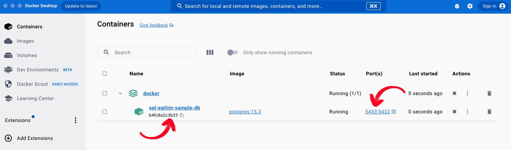
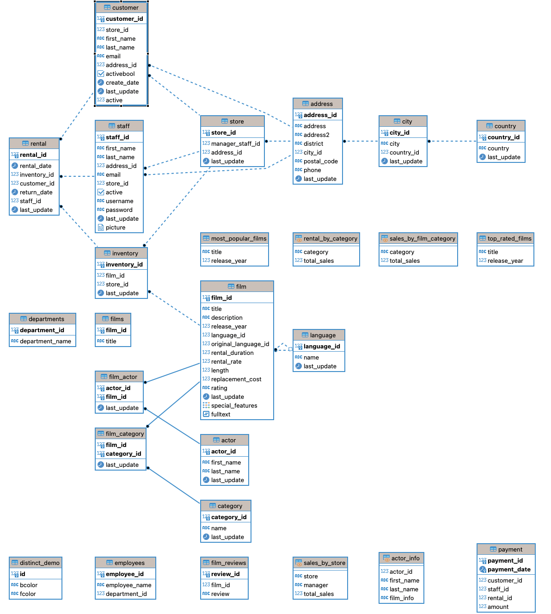

# Lab Ortamı Kurulumu

Herhangi bir terminal üzerinden repository klonlanır:

```sh
git clone https://github.com/berkanyiildirim/yte-sql-egitim.git
```

docker-compose.yml dosyasının bulunduğu dizine gidilir:

```sh
cd yte-sql-egitim/sample-db/
```

Örnek veritabanı aşağıdaki komut ile oluşturulur:

```sh
docker-compose up -d
```

Not: İlk çalıştırma sırasında PostgreSQL imajı DockerHub üzerinden çekileceği için 1-2 dakika işlem sürebilir.

Docker desktop üzerinden örnek veritabanının oluşturulduğu kontrol edilir.



Bağlantı bilgileri:

```bash
kullanıcı: postgres
parola: yte
port: 5439
```

## ER Diyagram


